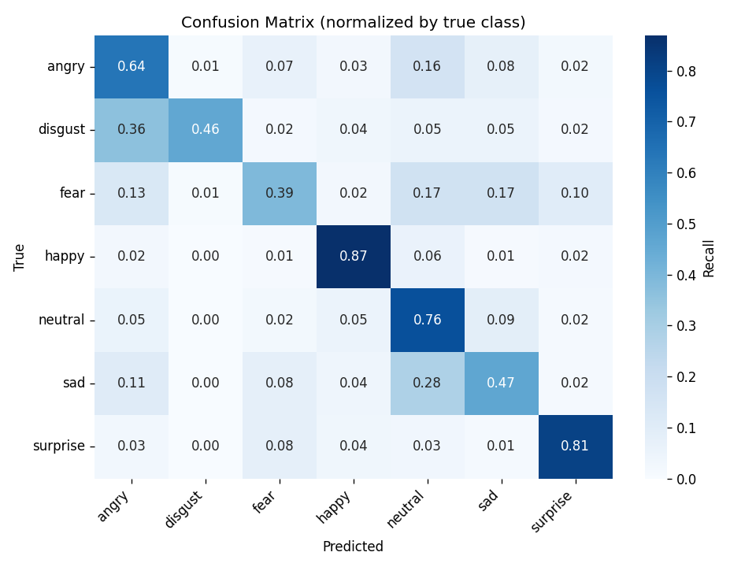
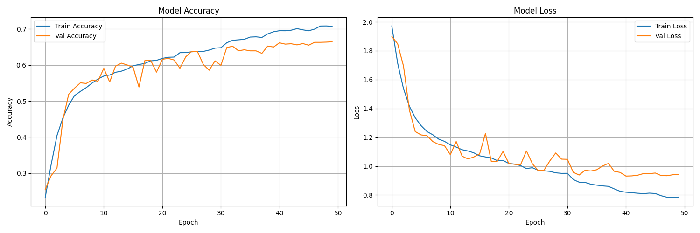

# Face Emotion Recognition

[](https://github.com/tangmanh891/face-emotion-recognition/actions/workflows/ci.yml)
[](https://www.python.org/)
[](#kiểm-thử)
[](LICENSE)

Hệ thống nhận diện cảm xúc khuôn mặt sử dụng CNN (TensorFlow/Keras), MediaPipe BlazeFace, và Flask.
Dự án hỗ trợ 2 luồng chính:
- Phân tích ảnh upload
- Nhận diện realtime từ webcam trên web


## Tính năng

- Nhận diện 7 cảm xúc: `Tức giận`, `Ghê tởm`, `Sợ hãi`, `Vui vẻ`, `Buồn bã`, `Ngạc nhiên`, `Bình thường`
- Detect nhiều khuôn mặt trong cùng một ảnh/frame
- Trả về xác suất từng cảm xúc (`probabilities`) cho mỗi khuôn mặt
- Web UI với biểu đồ trực quan (Chart.js)
- API backend có validate input cho ảnh upload/base64

## Công nghệ

- Backend: Flask
- Deep Learning: TensorFlow/Keras
- Face Detection: MediaPipe BlazeFace (mặc định) hoặc OpenCV Haar Cascade (fallback)
- Computer Vision: OpenCV
- Frontend: HTML/CSS/JavaScript + Bootstrap 5
- Visualization: Chart.js, Matplotlib

## Cấu trúc dự án

```text
face-emotion-recognition/
├── app.py                        # Flask server (lazy-loads model, REST + base64)
├── Dockerfile                    # multi-stage runtime image
├── docker-compose.yml
├── requirements*.txt             # split: full / serve-only / dev tools
├── pyproject.toml                # ruff + pytest + coverage config
├── .github/workflows/ci.yml      # lint + tests + coverage on every push
├── models/
│   ├── emotion_model.keras       # trained CNN (gitignored)
│   ├── blaze_face_short_range.tflite  # MediaPipe face detector
│   ├── class_indices.json        # label mapping written by train.py
│   ├── confusion_matrix.png      # evaluation artifact
│   └── evaluation.json           # full metrics (per-class F1, latency)
├── src/
│   ├── emotion_detector.py       # classifier + pluggable face backend
│   ├── face_detectors.py         # HaarFaceDetector + MediaPipeFaceDetector
│   ├── model.py                  # CNN architecture
│   ├── train.py                  # training loop
│   ├── evaluate.py               # generates metrics + confusion matrix
│   └── realtime_detection.py     # desktop OpenCV webcam loop
├── scripts/
│   ├── benchmark_detectors.py    # Haar vs MediaPipe latency/recall
│   └── run-wsl.ps1               # one-liner WSL launcher (Windows)
├── static/
├── templates/
└── tests/
    ├── test_app.py               # Flask API + edge cases
    ├── test_emotion_detector.py  # classifier logic + class_indices
    ├── test_face_detectors.py    # Haar + MediaPipe wrappers
    └── face_samples/             # sample images for benchmark
```

## Cài đặt

### 1. Clone repo

```bash
git clone https://github.com/tangmanh891/face-emotion-recognition.git
cd face-emotion-recognition
```

### 2. Tạo môi trường

```bash
conda create -n emotion-recognition python=3.10 -y
conda activate emotion-recognition
```

### 3. Cài dependencies

Dự án có 3 file requirements:

| File | Mục đích |
|---|---|
| `requirements.txt` | Full stack (training + serving + test) |
| `requirements-serve.txt` | Runtime tối thiểu cho Docker/deploy (~600MB image) |
| `requirements-dev.txt` | Tools (pytest, ruff) — dùng kèm `-serve.txt` cho CI |

```bash
pip install -r requirements.txt           # dev local đầy đủ
# hoặc
pip install -r requirements-serve.txt -r requirements-dev.txt  # CI / minimal
```

### 4. Download MediaPipe face detection model (~230 KB)

```bash
curl -L -o models/blaze_face_short_range.tflite \
  https://storage.googleapis.com/mediapipe-models/face_detector/blaze_face_short_range/float16/latest/blaze_face_short_range.tflite
```

> Nếu skip bước này, app sẽ tự fallback sang Haar Cascade.

## Chuẩn bị dữ liệu

Dataset khuyến nghị: [FER-2013](https://www.kaggle.com/datasets/msambare/fer2013)

Đặt dữ liệu theo cấu trúc:

```text
data/
├── train/
│   ├── angry/
│   ├── disgust/
│   ├── fear/
│   ├── happy/
│   ├── sad/
│   ├── surprise/
│   └── neutral/
└── test/
    ├── angry/
    ├── disgust/
    ├── fear/
    ├── happy/
    ├── sad/
    ├── surprise/
    └── neutral/
```

## Huấn luyện model

```bash
python src/train.py
```

Sau khi training xong, các artifact sau sẽ được lưu trong `models/`:
- `emotion_model.keras` — model tốt nhất (theo val_accuracy)
- `class_indices.json` — mapping `{class_name: index}` mà model đã học. Inference đọc file này để đảm bảo đúng thứ tự nhãn.
- `training_history.png` — biểu đồ accuracy/loss qua các epoch

Lưu ý:
- Validation được cấu hình **không augment** để metric ổn định hơn.
- Nếu muốn hiển thị biểu đồ trực tiếp khi train, bật biến môi trường:

```bash
set SHOW_PLOTS=1
```

## Đánh giá model

```bash
python src/evaluate.py
```

Tuỳ chọn:
- `--model models/your_model.keras` — chỉ định model khác
- `--no-benchmark` — bỏ qua đo latency

Output trong `models/`:
- `evaluation.json` — accuracy, macro/weighted F1, per-class precision/recall/F1, confusion matrix, inference latency (mean/median/p95)
- `confusion_matrix.png` — confusion matrix đã chuẩn hoá theo recall

## Kết quả (Results)

Train trên FER-2013 (28,709 ảnh train / 7,178 ảnh test), 50 epochs, GPU NVIDIA GTX 1070.

| Metric | Giá trị |
|---|---|
| **Test accuracy** | **66.88%** |
| Macro F1 | 0.6339 |
| Weighted F1 | 0.6633 |
| Inference latency | 87.3 ms/face (mean), 104.2 ms (p95) — batch_size=1, GPU |
| Model size | ~5 MB (.keras) |

> Tham chiếu: SOTA trên FER-2013 ~73-75% (state-of-the-art năm 2024 với ViT/EfficientNet pretrained). Baseline CNN từ scratch thường ở mức 60-66%.

### Per-class F1

| Class | Precision | Recall | F1 | Support |
|---|---:|---:|---:|---:|
| happy | 0.886 | 0.869 | **0.877** | 1774 |
| surprise | 0.772 | 0.810 | **0.790** | 831 |
| neutral | 0.532 | 0.762 | 0.626 | 1233 |
| angry | 0.580 | 0.638 | 0.608 | 958 |
| disgust | 0.662 | 0.460 | 0.543 | 111 |
| sad | 0.593 | 0.468 | 0.523 | 1247 |
| fear | 0.586 | 0.393 | 0.470 | 1024 |

**Quan sát**:
- `happy` và `surprise` được nhận diện tốt nhất do biểu cảm khác biệt rõ rệt.
- `fear`/`sad` thường bị nhầm với `neutral` — đặc trưng kinh điển của FER-2013 và là vấn đề mà các paper SOTA cũng phải xử lý.
- `disgust` có support thấp nhất (111 ảnh), F1 dao động mạnh.




## Face detector: MediaPipe vs Haar Cascade

Dự án support 2 backend face detection, chuyển đổi qua env var `EMOTION_FACE_BACKEND` (`mediapipe` mặc định, `haar` fallback).

**Kết quả benchmark** trên 6 ảnh test (1 ảnh gốc + 5 biến thể tổng hợp), đo trên WSL2 + GTX 1070:

| Backend | Latency (mean) | Latency (p95) | Frontal | Low-light | Blurred | Rotated 30° |
|---|---:|---:|:---:|:---:|:---:|:---:|
| Haar Cascade | 58.7 ms | 79.6 ms | ✅ | ✅ | ✅ | ❌ |
| **MediaPipe BlazeFace** | **7.4 ms** | **10.2 ms** | ✅ | ✅ | ✅ | ❌ |

**Kết luận**:
- **MediaPipe nhanh ~8× hơn Haar** ở mức single-image inference — đây là khác biệt quyết định cho webcam realtime (giảm CPU/GPU usage, tăng FPS).
- Cả hai detector đều fail trên ảnh xoay 30° và mặt quá nhỏ — đây là giới hạn của short-range model. Với ứng dụng cần xa hơn 2m, swap sang model `blaze_face_full_range.tflite`.
- Trên ảnh "selfie distance" (use case chính của project), MediaPipe có recall ≥ Haar và speed vượt trội.

> Benchmark có thể tái chạy với `python scripts/benchmark_detectors.py --images <dir>`. Thêm ảnh chân dung thật vào `tests/face_samples/` để có đánh giá khách quan hơn.

### Cách chuyển backend

```bash
# Default: MediaPipe
python app.py

# Force Haar Cascade
EMOTION_FACE_BACKEND=haar python app.py
```

## Chạy với Docker (khuyến nghị cho deploy)

```bash
docker compose up --build
```

Hoặc:

```bash
docker build -t face-emotion-recognition:latest .
docker run -p 5000:5000 face-emotion-recognition:latest
```

Sau đó mở `http://127.0.0.1:5000`. Health check tự động chạy mỗi 30s.

Image cuối cùng ~700MB (Python 3.12-slim + TF CPU + MediaPipe + OpenCV headless), bundle sẵn model `.keras` và face detector `.tflite`. Multi-stage build tách build deps khỏi runtime, chạy non-root user.

## Chạy web app (không Docker)

### Cách 1: WSL2 (Windows) — khuyến nghị nếu có GPU NVIDIA

Tránh được vấn đề tương thích Keras 2/3 và tận dụng GPU acceleration.

```powershell
.\scripts\run-wsl.ps1
```

Hoặc thủ công:

```powershell
wsl -d Ubuntu-24.04 -e bash -c 'cd /mnt/<your-path> && TF_USE_LEGACY_KERAS=1 ~/venvs/emotion/bin/python app.py'
```

### Cách 2: Native (Linux/macOS, hoặc Windows không cần GPU)

```bash
TF_USE_LEGACY_KERAS=1 python app.py
```

> **Lưu ý**: `TF_USE_LEGACY_KERAS=1` cần thiết khi load model `.keras` được train bằng `tf-keras` (Keras 2). Nếu model của bạn được train với Keras 3 native, có thể bỏ env var này.

Mặc định app chạy ở `http://127.0.0.1:5000`.

Biến môi trường hỗ trợ:
- `HOST` (mặc định `127.0.0.1`)
- `PORT` (mặc định `5000`)
- `FLASK_DEBUG` (`1/true/yes` để bật debug)
- `TF_USE_LEGACY_KERAS=1` (bắt buộc với model `.keras` legacy)

### Health check

```bash
curl http://127.0.0.1:5000/health
```

Ví dụ response:

```json
{
  "status": "ok",
  "model_loaded": false,
  "model_found": false,
  "model_path": ".../models/emotion_model.h5"
}
```

Ý nghĩa:
- `model_found=false`: chưa có file model
- `model_loaded=false`: model chưa được nạp, API detect sẽ trả lỗi cho đến khi có model hợp lệ

## Chạy realtime bằng webcam (desktop OpenCV)

```bash
python src/realtime_detection.py
```

Phím tắt:
- `q`: thoát
- `s`: lưu ảnh hiện tại
- `p`: hiển thị biểu đồ cảm xúc

## API

### `POST /detect`

Upload ảnh multipart:
- field bắt buộc: `image`
- dung lượng tối đa: `5MB`
- định dạng hỗ trợ: `jpg`, `jpeg`, `png`, `webp`

Response thành công:

```json
{
  "success": true,
  "faces_count": 1,
  "faces": [
    {
      "emotion": "Vui vẻ",
      "confidence": 98.76,
      "position": { "x": 10, "y": 20, "w": 100, "h": 100 },
      "probabilities": {
        "Vui vẻ": 98.76,
        "Buồn bã": 0.50
      }
    }
  ],
  "image": "data:image/jpeg;base64,..."
}
```

### `POST /detect_base64`

Body JSON:

```json
{ "image": "data:image/jpeg;base64,..." }
```

Response tương tự `/detect` (không trả ảnh đã vẽ).

## Kiểm thử

Test suite (33 tests, **82% coverage**) chạy với pytest:

```bash
pytest tests/ --cov=src --cov=app --cov-report=term-missing
```

Lint với ruff:

```bash
ruff check .
```

CI tự động chạy cả 2 trên mỗi push/PR — xem `.github/workflows/ci.yml`.

### Coverage breakdown

| Module | Coverage |
|---|---:|
| `src/face_detectors.py` | 90% |
| `app.py` | 82% |
| `src/emotion_detector.py` | 75% |
| **Total** | **82%** |

## Troubleshooting

- Lỗi `Model chua duoc load`
  - Kiểm tra file `models/emotion_model.keras` (hoặc `emotion_model.h5` nếu là model cũ).
- Nhãn dự đoán bị sai class
  - Đảm bảo `models/class_indices.json` được sinh ra cùng model. Train lại bằng `python src/train.py` để tái tạo mapping.
- Không detect được mặt
  - Kiểm tra ánh sáng, góc mặt, chất lượng ảnh.
- Webcam trên web không chạy
  - Kiểm tra quyền camera của trình duyệt.
